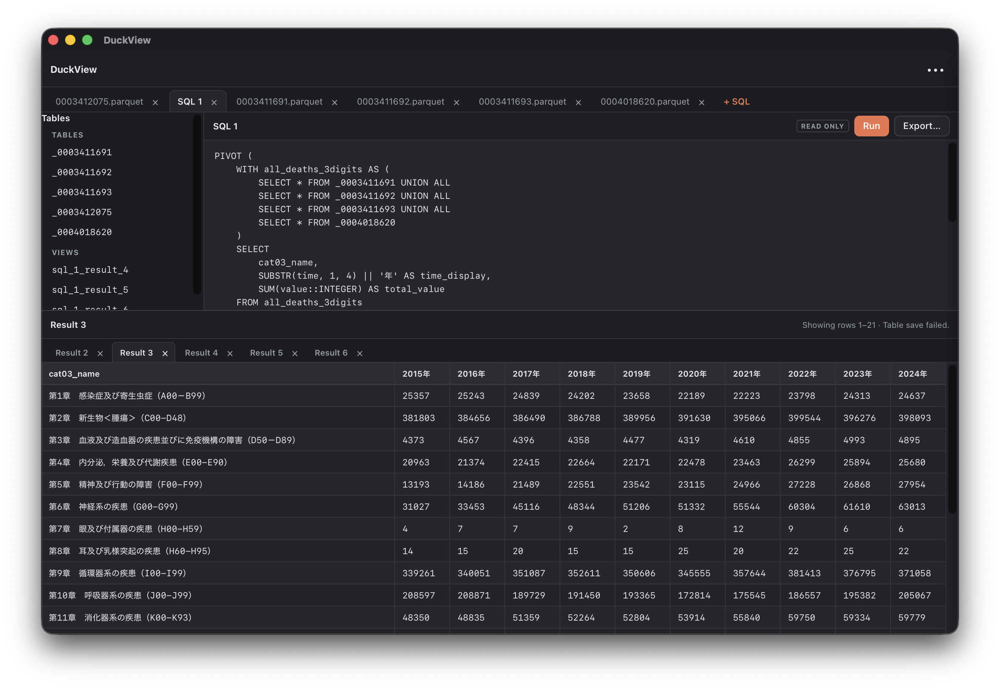

# DuckView
Parquet file viewer and SQL editor.

DuckView is a powerful, modern Parquet file viewer and SQL editor built with Tauri and DuckDB.
It started as a complete rewrite and expansion of the excellent parquetview (an OSX Parquet viewer),
supercharging it with multi-tab support and analytical capabilities.

## License & Acknowledgments
This project is licensed under the MIT License - see the LICENSE file for details.
This project is a heavily modified and expanded derivative work based on [ParquetView](https://github.com/Alyetama/parquetview) (Copyright © Alyetama).
We are incredibly grateful for their initial Tauri architectural design which made this project possible.

## License
The source code is licensed MIT. The website content is licensed CC BY 4.0,see LICENSE.
